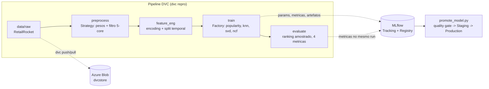

# recsys-ecommerce

Sistema de recomendação de produtos para e-commerce baseado no comportamento de navegação dos usuários — **FIAP Pós Tech MLE, Tech Challenge Fase 2**.

Rede neural **NCF (Neural Collaborative Filtering)** em PyTorch treinada sobre o dataset RetailRocket (2,7M eventos reais), com pipeline MLOps completo: dados versionados com **DVC** (remote em Azure Blob), experimentos e **Model Registry** no **MLflow** (promoção Staging → Production com quality gate), containerização **Docker** multi-stage e clean code com SOLID, type hints e design patterns (Factory Method + Strategy).

📄 Documentos: [Model Card](MODEL_CARD.md) · [Roteiro do projeto](docs/roteiro-tech-challenge.md)

## Arquitetura



## Resultados

Avaliação por ranking amostrado (protocolo do paper do NCF: item verdadeiro vs 99 negativos não vistos), split temporal leave-last-out, 76.404 usuários de teste:

| Modelo | HitRate@10 | NDCG@10 | MRR@10 |
|---|---|---|---|
| Popularity (baseline) | 0.541 | 0.320 | 0.253 |
| ItemKNN | 0.949 | 0.810 | 0.766 |
| TruncatedSVD (linear) | 0.541 | 0.373 | 0.322 |
| **NCF (early stopping)** | **0.667** | **0.474** | **0.414** |

O NCF supera popularidade e SVD em todas as métricas (+27% de NDCG sobre a fatoração linear — o ganho da não-linearidade). A liderança do ItemKNN reflete majoritariamente **reconsumo** (o último evento tende a ser um item já visitado); análise completa no [Model Card](MODEL_CARD.md).

## Pré-requisitos

- [uv](https://docs.astral.sh/uv/) (gerenciador de pacotes Python)
- [Docker Desktop](https://www.docker.com/products/docker-desktop/) (para o MLflow server e o serviço de treino)
- Git

## Instalação

### macOS / Linux

```bash
git clone https://github.com/rafaneder-maiorino/recsys-ecommerce.git
cd recsys-ecommerce
uv sync                                # cria .venv e instala as versões exatas do uv.lock
cp .env.example .env
uv run python scripts/validate_env.py  # valida Python, libs e configuração
```

### Windows (PowerShell)

```powershell
git clone https://github.com/rafaneder-maiorino/recsys-ecommerce.git
cd recsys-ecommerce
uv sync
Copy-Item .env.example .env
uv run python scripts/validate_env.py
```

> **Windows:** instale o uv com `powershell -ExecutionPolicy ByPass -c "irm https://astral.sh/uv/install.ps1 | iex"` (reabra o PowerShell em seguida).

> `uv sync` cumpre o papel de `poetry install`: instalação determinística a partir do lock file commitado (`uv.lock`).

## Obtendo os dados (DVC)

Os dados (~940 MB) ficam em um remote DVC no Azure Blob Storage. Para baixá-los com o token de leitura fornecido para avaliação:

```bash
uv run dvc remote modify --local azure sas_token "se=2026-10-31&sp=rl&sv=2026-04-06&sr=c&sig=oZ5hKodQe2dGBNYdUgHuNjm6NmXm%2BOAX0VKz%2BVi6XMU%3D"
uv run dvc pull
```

Alternativa sem token: baixe o [RetailRocket no Kaggle](https://www.kaggle.com/datasets/retailrocket/ecommerce-dataset) e extraia os 4 CSVs em `data/raw/`.

## Executando o pipeline

```bash
docker compose up -d mlflow    # sobe o MLflow server em http://localhost:5001
uv run dvc repro               # preprocess -> feature_eng -> train -> evaluate
cat metrics.json               # metricas da avaliacao (tambem em dvc metrics show)
```

Cada execução registra um run no MLflow com parâmetros, métricas, curvas de loss por época (NCF), o artefato do modelo e a tag `train_data_version` — o hash DVC do snapshot exato dos dados que treinou aquele modelo.

**Trocar de modelo:** edite `train.model` no `params.yaml` (`popularity` | `item_knn` | `svd` | `ncf`) e rode `uv run dvc repro`. O DVC reexecuta apenas os stages afetados.

## Treino dentro do Docker

```bash
docker compose build train
docker compose run --rm train dvc repro
```

O serviço `train` monta o projeto, aguarda o healthcheck do MLflow e executa o mesmo pipeline dentro do container (imagem multi-stage `python:3.11-slim`, usuário não-root). As métricas reproduzem as do host bit a bit — seeds globais fixadas.

## Model Registry (governança)

```bash
uv run python scripts/promote_model.py
```

O script aplica um **quality gate** (mínimos por métrica definidos em `params.yaml`; o modelo só avança se superar o baseline de popularidade), registra a versão como `recsys-ncf`, promove **None → Staging → Production** (arquivando versões anteriores), define o alias `production` e grava as tags de auditoria `approved_by`, `approval_notes` e `train_data_version`. Se as métricas não passarem no gate, a promoção é bloqueada com código de saída 1.

## Qualidade de código

```bash
uv run pytest          # 35 testes unitarios
uv run ruff check .    # lint (convencao Google, complexidade <= 8)
uv run pre-commit install
```

## Estrutura do projeto

```
├── configs/                # (reservado para configs declarativas)
├── data/                   # dados versionados via DVC (fora do Git)
├── docs/                   # roteiro do projeto
├── models/                 # artefatos de modelo (DVC)
├── scripts/                # validate_env, explore_retailrocket, promote_model
├── src/recsys/
│   ├── config.py           # Pydantic Settings (.env)
│   ├── seeding.py          # seed global (random, numpy, torch)
│   ├── data/               # PreprocessingStrategy (Strategy pattern)
│   ├── features/           # encoding + split temporal leave-last-out
│   ├── models/             # ModelFactory (Factory Method) + 4 modelos
│   ├── training/           # MLflow tracking, lineage e registry/governanca
│   ├── evaluation/         # HitRate, Precision, NDCG, MRR @k
│   └── pipelines/          # entrypoints dos 4 stages do DVC
├── tests/                  # pytest
├── params.yaml             # fonte unica de parametros (por stage)
├── dvc.yaml / dvc.lock     # definicao do pipeline
├── Dockerfile              # multi-stage: builder (uv) + runtime slim non-root
└── docker-compose.yml      # mlflow server (healthcheck) + servico de treino
```

## Design patterns

- **Factory Method** (`src/recsys/models/factory.py`): modelos se auto-registram via decorator; o pipeline instancia por nome vindo do `params.yaml` — aberto para extensão, fechado para modificação.
- **Strategy** (`src/recsys/data/preprocessors.py`): etapas de pré-processamento intercambiáveis e composáveis, sem `if/else` no pipeline.

## Decisões técnicas principais

1. **Split temporal**, nunca aleatório: em recomendação, split aleatório vaza o futuro para o treino.
2. **Filtro 5-core** fundamentado na EDA: mediana de 1 interação/usuário; abaixo de 5 eventos não há sinal para o embedding.
3. **Pesos de evento 1/3/5** (view/addtocart/transaction) como intensidade do feedback implícito na loss.
4. **Avaliação amostrada** (99 negativos): mantém a comparação entre modelos idêntica e computacionalmente viável (ranquear o catálogo inteiro com o MLP custaria ~8 bi de forwards).
5. **Stages + alias no Registry**: o fluxo clássico exigido (deprecado desde o MLflow 2.9) coexiste com o alias `production`, mantendo o projeto à prova de futuro.

## Deploy em produção (bônus)

A API de inferência está publicada no **Azure Container Apps**, servindo o modelo `recsys-ncf` promovido a Production:

- **Health:** https://recsys-api.lemonrock-9ecf7f11.brazilsouth.azurecontainerapps.io/health
- **Recomendação:** https://recsys-api.lemonrock-9ecf7f11.brazilsouth.azurecontainerapps.io/recommend/42?top_k=5
- **Documentação interativa (Swagger):** https://recsys-api.lemonrock-9ecf7f11.brazilsouth.azurecontainerapps.io/docs

Build da imagem: `docker buildx build --platform linux/amd64 -f Dockerfile.api ...` (cross-build ARM→x86), registro no Azure Container Registry, deploy com ingress externo e healthcheck.

---

*Vídeo de apresentação (método STAR): https://youtu.be/gU7bzwPut78*
